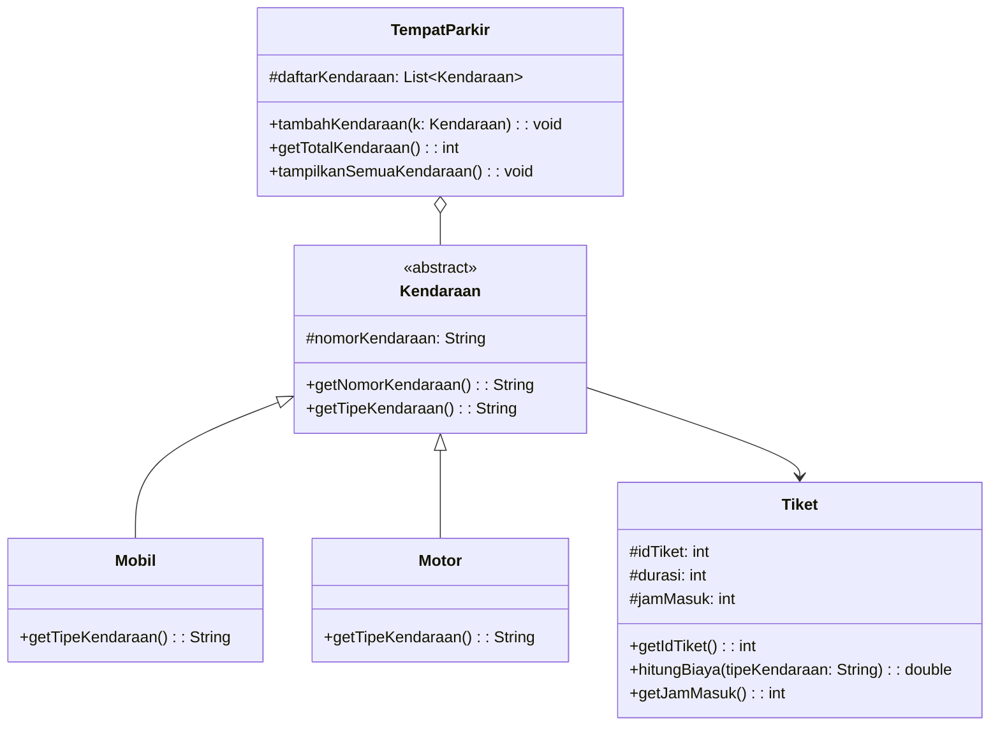

Nama    : Arjunina Maqbulin Usman  
NRP    : 5027251007

# Parking Management System (OOP Project)

## 1. Deskripsi Kasus

Sistem parkir merupakan fasilitas umum yang digunakan untuk mengatur kendaraan yang masuk dan keluar dari suatu area. Namun, dalam praktiknya sering terjadi kesulitan dalam pencatatan kendaraan, jenis kendaraan, serta pengelolaan tiket parkir.

Untuk mengatasi permasalahan tersebut, dibuat sebuah sistem **Parking Management System** berbasis Object-Oriented Programming (OOP). Sistem ini bertujuan untuk mencatat kendaraan yang masuk, mengelompokkan jenis kendaraan, serta mengelola data parkir secara lebih terstruktur.

## 2. Tujuan Sistem

1. Mencatat kendaraan yang masuk ke area parkir  
2. Membedakan jenis kendaraan (mobil dan motor)  
3. Mengelola tiket parkir  
4. Menghitung jumlah kendaraan yang sedang parkir  

---

## 3. Class Diagram




## 4. Code Program
```Java
import java.util.ArrayList;
import java.util.List;

// abstraction
abstract class Kendaraan {
    protected String nomorKendaraan;

    public Kendaraan(String nomorKendaraan) {
        this.nomorKendaraan = nomorKendaraan;
    }

    public String getNomorKendaraan() {
        return nomorKendaraan;
    }

    // setiap kendaraan harus punya jenis (mobil/motor)
    public abstract String getTipeKendaraan();
}

// inheritance
class Mobil extends Kendaraan {
    public Mobil(String nomorKendaraan) {
        super(nomorKendaraan);
    }

    public String getTipeKendaraan() {
        return "Mobil";
    }
}

class Motor extends Kendaraan {
    public Motor(String nomorKendaraan) {
        super(nomorKendaraan);
    }

    public String getTipeKendaraan() {
        return "Motor";
    }
}

class Tiket {
    private int idTiket;
    private int durasi;
    private int jamMasuk;

    public Tiket(int idTiket, int durasi, int jamMasuk) {
        this.idTiket = idTiket;
        this.durasi = durasi;
        this.jamMasuk = jamMasuk;
    }

    public int getIdTiket() {
        return idTiket;
    }

    // biaya parkir berdasarkan jenis kendaraan
    public double hitungBiaya(String tipeKendaraan) {
        if ("Mobil".equals(tipeKendaraan)) {
            return durasi * 5000;
        } else {
            return durasi * 2000;
        }
    }

    public int getJamMasuk() {
        return jamMasuk;
    }
}

// sistem parkir
class TempatParkir {
    // menyimpan kendaraan yang sedang parkir
    private List<Kendaraan> daftarKendaraan = new ArrayList<>();

    public void tambahKendaraan(Kendaraan k) {
        daftarKendaraan.add(k);
        System.out.println(k.getTipeKendaraan() + " masuk: " + k.getNomorKendaraan());
    }

    public int getTotalKendaraan() {
        return daftarKendaraan.size();
    }

    // menampilkan semua kendaraan
    public void tampilkanSemuaKendaraan() {
        System.out.println("\nDaftar kendaraan di parkiran:");
        for (Kendaraan k : daftarKendaraan) {
            System.out.println("- " + k.getTipeKendaraan() + " | " + k.getNomorKendaraan());
        }
    }
}

public class Main {
    public static void main(String[] args) {
        TempatParkir parkir = new TempatParkir();

        Kendaraan mobil1 = new Mobil("B 1234 ABC");
        Kendaraan motor1 = new Motor("AE 5678 XYZ");

        parkir.tambahKendaraan(mobil1);
        parkir.tambahKendaraan(motor1);

        Tiket tiket1 = new Tiket(1, 2, 10);
        Tiket tiket2 = new Tiket(2, 3, 11);

        System.out.println("\n=== STRUK PARKIR ===");
        System.out.println("Ticket ID: " + tiket1.getIdTiket());
        System.out.println("Jenis: " + mobil1.getTipeKendaraan());
        System.out.println("Plat: " + mobil1.getNomorKendaraan());
        System.out.println("Jam masuk: " + tiket1.getJamMasuk());
        System.out.println("Biaya: " + tiket1.hitungBiaya(mobil1.getTipeKendaraan()));

        System.out.println("\n=== STRUK PARKIR ===");
        System.out.println("Ticket ID: " + tiket2.getIdTiket());
        System.out.println("Jenis: " + motor1.getTipeKendaraan());
        System.out.println("Plat: " + motor1.getNomorKendaraan());
        System.out.println("Jam masuk: " + tiket2.getJamMasuk());
        System.out.println("Biaya: " + tiket2.hitungBiaya(motor1.getTipeKendaraan()));

        parkir.tampilkanSemuaKendaraan();

        System.out.println("\nTotal kendaraan: " + parkir.getTotalKendaraan());
    }
}
```

## 5. Output


## 6. Prinsip OOP yang Diterapkan

### 1. Encapsulation
Encapsulation diterapkan dengan menyembunyikan data menggunakan modifier `private` dan `protected`. Contohnya pada atribut `nomorKendaraan` di class `Kendaraan` serta `idTiket`, `durasi`, dan `jamMasuk` di class `Tiket`. Data tersebut tidak dapat diakses langsung dari luar class, melainkan melalui getter seperti `getNomorKendaraan()` dan `getIdTiket()`.

### 2. Abstraction
Abstraction diterapkan pada class `Kendaraan` yang bersifat abstract. Class ini hanya mendefinisikan struktur umum kendaraan, khususnya method `getTipeKendaraan()` tanpa implementasi. Implementasi detailnya diserahkan kepada class turunan seperti `Mobil` dan `Motor`.

### 3. Inheritance
Inheritance terlihat pada class `Mobil` dan `Motor` yang mewarisi class `Kendaraan`. Dengan demikian, kedua class tersebut dapat menggunakan atribut dan method dari class induk tanpa harus menuliskan ulang.

### 4. Polymorphism
Polymorphism diterapkan melalui method `getTipeKendaraan()` yang dioverride pada class `Mobil` dan `Motor`. Meskipun dipanggil dari tipe yang sama yaitu `Kendaraan`, hasil yang diberikan berbeda sesuai dengan jenis objeknya.

## 7. Keunikan Project

Keunikan dari project ini terletak pada penerapan sistem parkir yang sederhana namun tetap realistis. Program tidak hanya mencatat kendaraan yang masuk, tetapi juga menampilkan informasi detail seperti jenis kendaraan, nomor kendaraan, serta waktu masuk melalui atribut `jamMasuk`.

Selain itu, terdapat perbedaan perhitungan biaya parkir berdasarkan jenis kendaraan, di mana mobil dan motor memiliki tarif yang berbeda. Hal ini membuat sistem lebih mendekati kondisi nyata di lingkungan parkir.

Project ini juga menggunakan abstraction. Dengan abstraction, sistem dapat dikembangkan lebih lanjut, misalnya dengan menambahkan jenis kendaraan baru atau fitur tambahan lainnya tanpa mengubah struktur utama program.
