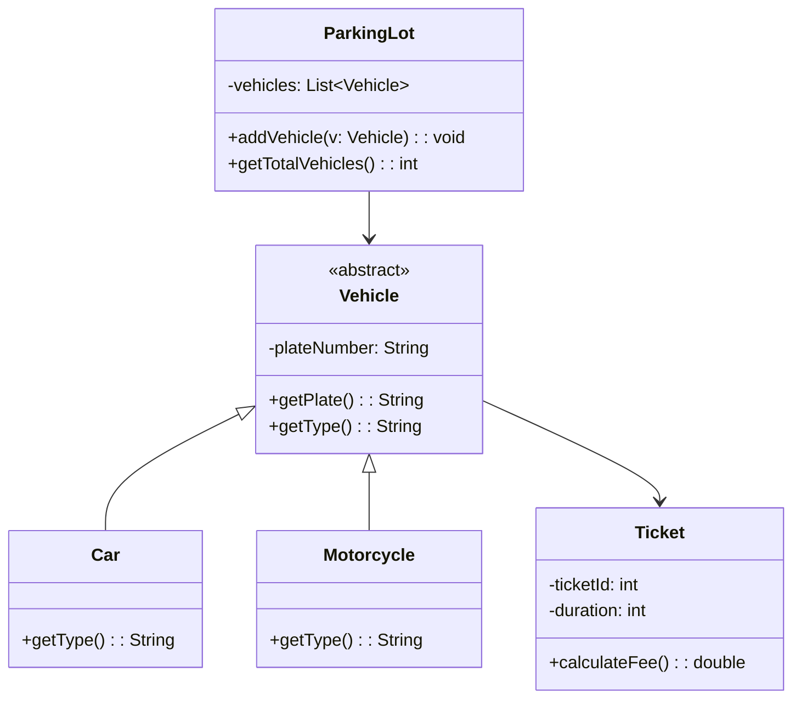

# Parking Management System (OOP Project)

## 1. Deskripsi Kasus

Sistem parkir merupakan fasilitas umum yang digunakan untuk mengatur kendaraan yang masuk dan keluar dari suatu area. Namun, dalam praktiknya sering terjadi kesulitan dalam pencatatan kendaraan, jenis kendaraan, serta pengelolaan tiket parkir.

Untuk mengatasi permasalahan tersebut, dibuat sebuah sistem **Parking Management System** berbasis Object-Oriented Programming (OOP). Sistem ini bertujuan untuk mencatat kendaraan yang masuk, mengelompokkan jenis kendaraan, serta mengelola data parkir secara lebih terstruktur.

## 2. Tujuan Sistem

1. Mencatat kendaraan yang masuk ke area parkir  
2. Membedakan jenis kendaraan (mobil dan motor)  
3. Mengelola tiket parkir  
4. Menghitung jumlah kendaraan yang sedang parkir  

---

## 3. Class Diagram



## 4. Code Program
```Java
import java.util.ArrayList;
import java.util.List;

abstract class Vehicle {
    protected String plateNumber;

    public Vehicle(String plateNumber) {
        this.plateNumber = plateNumber;
    }

    public String getPlate() {
        return plateNumber;
    }

    public abstract String getType();
}

class Car extends Vehicle {
    public Car(String plateNumber) {
        super(plateNumber);
    }

    public String getType() {
        return "Car";
    }
}

class Motorcycle extends Vehicle {
    public Motorcycle(String plateNumber) {
        super(plateNumber);
    }

    public String getType() {
        return "Motorcycle";
    }
}

class Ticket {
    private int ticketId;
    private int duration;

    public Ticket(int ticketId, int duration) {
        this.ticketId = ticketId;
        this.duration = duration;
    }

    public int getTicketId() {
        return ticketId;
    }

    public double calculateFee(String vehicleType) {
        if (vehicleType.equals("Car")) {
            return duration * 5000;
        } else {
            return duration * 2000;
        }
    }
}

class ParkingLot {
    private List<Vehicle> vehicles = new ArrayList<>();

    public void addVehicle(Vehicle v) {
        vehicles.add(v);
        System.out.println(v.getType() + " masuk: " + v.getPlate());
    }

    public int getTotalVehicles() {
        return vehicles.size();
    }
}

public class Main {
    public static void main(String[] args) {
        ParkingLot parking = new ParkingLot();

        Vehicle car = new Car("B 1234 ABC");
        Vehicle motor = new Motorcycle("AE 5678 XYZ");

        parking.addVehicle(car);
        parking.addVehicle(motor);

        Ticket ticket1 = new Ticket(1, 2);
        Ticket ticket2 = new Ticket(2, 3);

        System.out.println("Ticket ID: " + ticket1.getTicketId());
        System.out.println("Biaya mobil: " + ticket1.calculateFee(car.getType()));
        System.out.println("Biaya motor: " + ticket2.calculateFee(motor.getType()));

        System.out.println("Total kendaraan: " + parking.getTotalVehicles());
    }
}
```

## 5. Output
Car masuk: B 1234 ABC  
Motorcycle masuk: AE 5678 XYZ  
Ticket ID: 1  
Biaya mobil: 10000.0  
Biaya motor: 6000.0  
Total kendaraan: 2  


## 6. Prinsip OOP yang Diterapkan

### 1. Encapsulation
Encapsulation diterapkan dengan menyembunyikan data dalam class menggunakan modifier `private` dan `protected`. Contohnya, atribut `plateNumber` pada class `Vehicle` tidak dapat diakses langsung dari luar class, melainkan melalui method `getPlate()`.

### 2. Abstraction
Abstraction diterapkan pada class `Vehicle` yang bersifat abstract. Class ini hanya mendefinisikan struktur umum kendaraan tanpa implementasi detail pada method `getType()`, sehingga implementasinya diserahkan kepada subclass.

### 3. Inheritance
Inheritance terlihat pada class `Car` dan `Motorcycle` yang mewarisi class `Vehicle`. Dengan ini, kedua class tersebut dapat menggunakan atribut dan method dari parent class tanpa harus menulis ulang.

### 4. Polymorphism
Polymorphism diterapkan melalui method `getType()` yang dioverride di masing-masing subclass. Meskipun dipanggil dari tipe `Vehicle`, hasilnya berbeda tergantung objeknya (Car atau Motorcycle).
